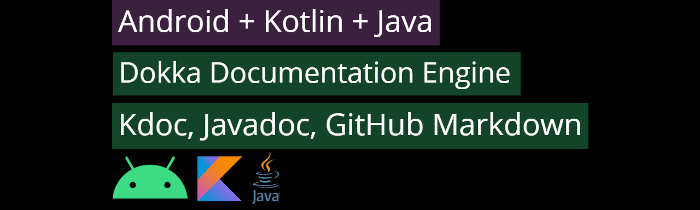

<h1 align="center">Android Dokka Documentation KDoc</h1> 

How to use Dokka Documentation Engine for Android Gradle to generate KDoc or Javadoc comments?

 

Dokka: https://github.com/Kotlin/dokka

 

Written Usage Instructions: https://medium.com/androiddevnotes/how-to-use-dokka-documentation-engine-for-android-gradle-to-generate-kdoc-or-javadoc-comments-2b5f177595ec

 

  
  

 

</img>

 

## Output

 

Documentation generated: https://androiddevnotesyoutube.github.io/android-dokka-documentation-kdoc/documentation/html/navigation.html

 

 

## :computer: Find us on

	<a href="https://github.com/androiddevnotes"> GitHub </a> / <a href="https://discord.gg/vBnEhuC"> Discord </a> / <a href="https://twitter.com/androiddevnotes"> Twitter </a> / <a href="https://www.instagram.com/androiddevnotes"> Instagram </a> / <a href="https://www.youtube.com/channel/UCQATLaT0xKkSm-KKVQzpu0Q"> YouTube </a> / <a href="https://medium.com/@androiddevnotes"> Medium </a>
	  
    </img>

